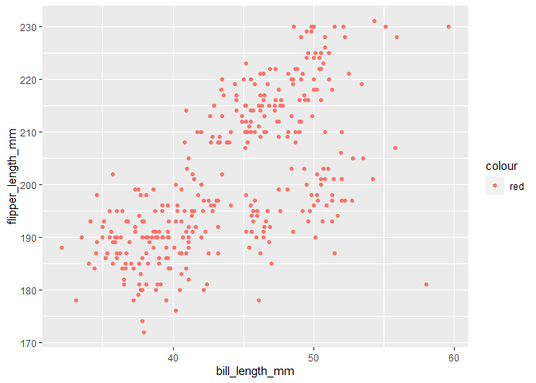

p8105\_hw1\_yf2555
================
Yihan Feng

This is my solution to homework 1.

``` r
library(tidyverse)
```

    ## -- Attaching packages -------------------------------------------- tidyverse 1.3.0 --

    ## v ggplot2 3.3.2     v purrr   0.3.4
    ## v tibble  3.0.3     v dplyr   1.0.2
    ## v tidyr   1.1.2     v stringr 1.4.0
    ## v readr   1.3.1     v forcats 0.5.0

    ## -- Conflicts ----------------------------------------------- tidyverse_conflicts() --
    ## x dplyr::filter() masks stats::filter()
    ## x dplyr::lag()    masks stats::lag()

# Problem 1

Create a data frame with specified elements

``` r
prob1_df = 
  tibble(
    samp = rnorm(10),
    samp_gt_0 = samp > 0,
    char_vec = c("a", "b", "c", "d", "e", "f", "g", "h", "i", "j"),
    fector_vec = factor(c("low", "low", "low", "mod", "mod", "mod", "mod", "high", "high", "high"))
  )
```

``` r
mean(pull(prob1_df, samp))
```

    ## [1] 0.0645412

``` r
mean(pull(prob1_df, samp_gt_0))
```

    ## [1] 0.5

``` r
mean(pull(prob1_df, char_vec))
```

    ## Warning in mean.default(pull(prob1_df, char_vec)): argument is not numeric or
    ## logical: returning NA

    ## [1] NA

``` r
mean(pull(prob1_df, fector_vec))
```

    ## Warning in mean.default(pull(prob1_df, fector_vec)): argument is not numeric or
    ## logical: returning NA

    ## [1] NA

I can take the mean of numbers and logical, but not character or factor.

``` r
as.numeric(pull(prob1_df, samp))
```

    ##  [1] -1.80017185  1.13898782 -0.73762552 -1.33291156  1.27235398  0.56857954
    ##  [7] -0.07959503 -1.04437593  1.33956710  1.32060343

``` r
as.numeric(pull(prob1_df, samp_gt_0))
```

    ##  [1] 0 1 0 0 1 1 0 0 1 1

``` r
as.numeric(pull(prob1_df, char_vec))
```

    ## Warning: NAs introduced by coercion

    ##  [1] NA NA NA NA NA NA NA NA NA NA

``` r
as.numeric(pull(prob1_df, fector_vec))
```

    ##  [1] 2 2 2 3 3 3 3 1 1 1

Numbers and logical variables can be converted to numeric, but character
or factor variables cannot. Only numeric values can be calculated (like
mean), which explains that I can take the mean of numbers and logical
variables, but not character or factor variables.

``` r
as.numeric(pull(prob1_df, samp_gt_0)) * pull(prob1_df, samp)
```

    ##  [1] 0.0000000 1.1389878 0.0000000 0.0000000 1.2723540 0.5685795 0.0000000
    ##  [8] 0.0000000 1.3395671 1.3206034

``` r
as.factor(pull(prob1_df, samp_gt_0)) * pull(prob1_df, samp)
```

    ## Warning in Ops.factor(as.factor(pull(prob1_df, samp_gt_0)), pull(prob1_df, : '*'
    ## not meaningful for factors

    ##  [1] NA NA NA NA NA NA NA NA NA NA

``` r
as.numeric(as.factor(pull(prob1_df, samp_gt_0))) * pull(prob1_df, samp)
```

    ##  [1] -1.80017185  2.27797565 -0.73762552 -1.33291156  2.54470796  1.13715909
    ##  [7] -0.07959503 -1.04437593  2.67913421  2.64120686

# Problem 2

## load the dataset

``` r
data("penguins", package = "palmerpenguins")
```

## description

  - The dataset includes 8 variables as: species, island,
    bill\_length\_mm, bill\_depth\_mm, flipper\_length\_mm,
    body\_mass\_g, sex, year.
    
      - Adelie, Chinstrap, Gentoo are the three species recorded in the
        dataset.
      - The sex is recorded as female, male.
      - The bill length ranges between 32.1, 59.6 in millimeters; the
        bill depth ranges between 13.1, 21.5 in millimeters; the flipper
        length ranges between 172, 231 in millimeters; and body mass
        ranges between 2700, 6300 in grams.

  - The size of the dataset has 344 rows and 8 columns.

  - The mean of flipper length is 200.9152047 mm.

## scatterplot graphing

``` r
ggplot(penguins, aes(x = bill_length_mm, y = flipper_length_mm, color = species), na.rm = TRUE) + geom_point()
```

    ## Warning: Removed 2 rows containing missing values (geom_point).

<!-- -->

``` r
ggsave("hw1_penguins_scatterplot.pdf")
```

    ## Saving 7 x 5 in image

    ## Warning: Removed 2 rows containing missing values (geom_point).
